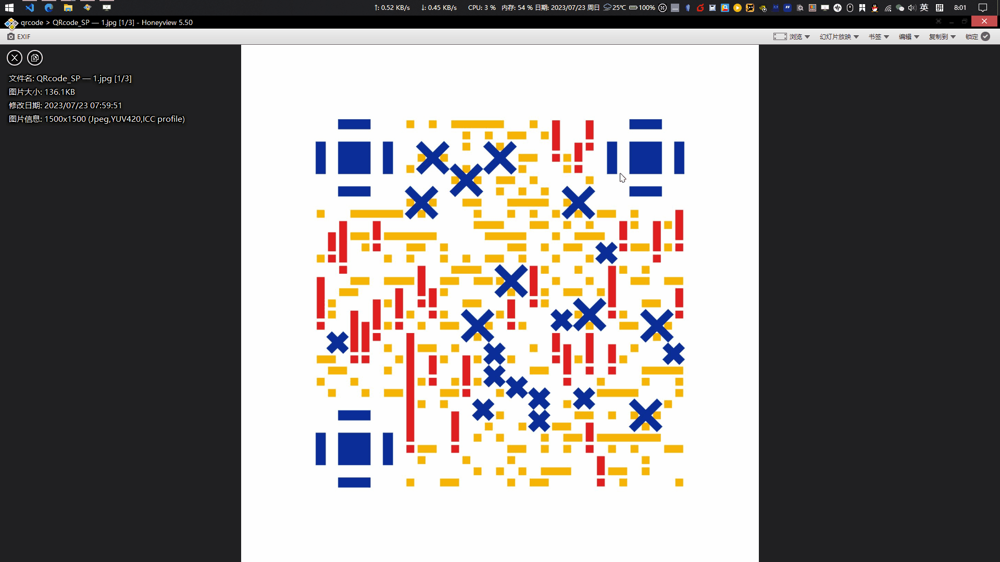

# Windows二维码识别器

[English](readme_en.md) | 中文

一款可以在 Windows 操作系统上运行的二维码识别器，识别结果保存在系统剪贴板中

- 从二维码中识别出其中的字符串内容
- 二维码识别功能由 [pyzbar](https://github.com/NaturalHistoryMuseum/pyzbar) 库实现
- 界面功能使用 [Qt](https://wiki.qt.io/Qt_for_Python) 搭建
- 程序打包使用 [PyInstaller](https://pyinstaller.org/) 实现

## 声明

### **本项目是开源、离线工程，其所有开发者以及维护者无法控制使用本项目的用途，也无法收集和获取用户输入，因此使用本项目识别二维码而造成的一切后果均由使用者自行承担，与本项目开发者及维护者无关！！！**

## 演示

## 使用源码

需要 `python>=3.8`，并安装依赖库 `pyzbar, opencv-python, PySide6`

环境搭建完毕，通过 `python main.py` 运行程序。注意 `sys_icon_dark.png` 文件，若不在 `main.py` 的同级目录，则会出现系统托盘没有图标的情况

## 致谢

- [pyzbar](https://github.com/NaturalHistoryMuseum/pyzbar)
- [Qt](https://qt.io)
- [opencv-python](https://github.com/opencv/opencv-python)
- [Python基于pyzbar、opencv、pyqt5库，实现二维码识别 gui 应用程序开发_唤醒手腕的博客-CSDN博客](https://blog.csdn.net/qq_47452807/article/details/124233469)
- [Qt项目中，实现屏幕截图功能的模块详细实现（可通用）_可吉拉多的专栏-知乎](https://zhuanlan.zhihu.com/p/212230990)